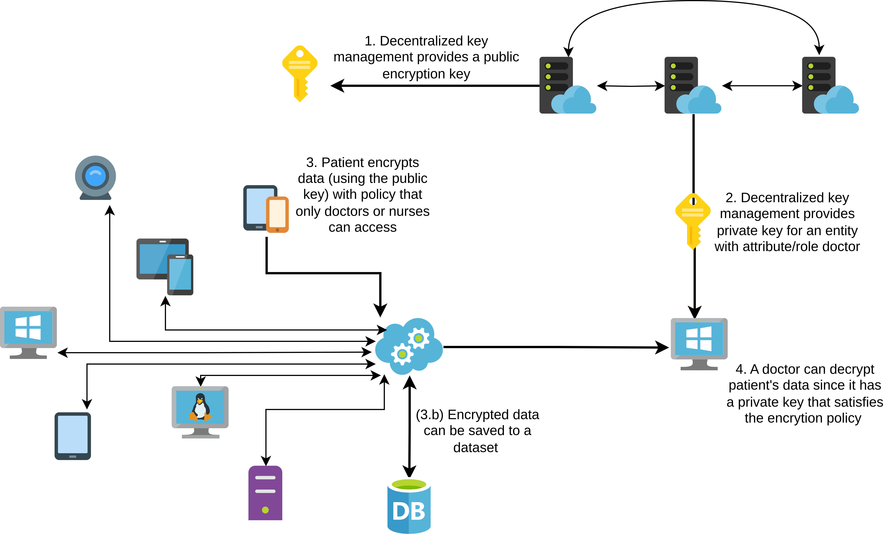

# AHE Demo

A demo of the Arcadian-IoT Hardened Encryption (AHE) library functionality.

It will feature encrytor clients and decryptor clients, written in various languages, requesting
cryptographic keys form the key management and sharing data in an
Attribute-Based Encryption setup.

The demo uses Go, Python, Java and NodeJs library for the AHE library.

## Prerequisites

### Key management

The demo uses AHE Key Management, hence before running the demo, the key management
needs to be deployed. Simply navigate to `hardened-encryption/ahe-key-server` and run
```
docker-compose up
```
This will set up various key managements: for FAME scheme (with centralized server or
decentralized) and for MAABE scheme. If the key management is deployed at a different
address than `localhost`, then change this address in the demo code.

### Shared object
The AHE library is written in Go and compiled in a shared `libahe.so`, that bindings to
other languages can use. Hence the object needs to be compiled. The demo uses the
one in `hardened-encryption/ahe-library/prebuild/linux-x86-64` that was build for a
Linux device with 64-bit X86 processor. If a different kind of device is used (for
example a Rasberry Pi), compile it (or use the precompiled)
and change the use of it in the code.

#### Python prerequisites
To use the Python demo, first install the Python library as described in this
[github repository](https://gitlab.com/arcadian_iot/hardened_encryption/-/tree/main/ahe-library).
Additionally the demo uses `requests` library, hence install it with
```console
$ python3 -m pip install requests
```

## Running the demo

Simply use provided `Makefile` with options `run-java` `run-go-fame`
`run-go-fame-decentralized` `run-python-fame` `run-python-fame-raspberry-pi` `run-python-fame-decentralized`
`run-python-maabe` `run-nodejs`. For example run
```console
$ make run-python-fame
```
to run a demo in which a client does the following:
* Requests a public ABE key from the key management and saves it in a wallet.
* Generates a private signing key and requests the key management to validate it (provide a signature
of the public signature key)
* Uses the public ABE key to encrypt a message with a decryption policy
* Signs the encrypted payload
* Requests a private ABE key from the key management with respect to some attributes 
and saves it in a wallet.
* Validates the authenticity of the ciphertext: check the signature of the ciphertext as well as
check that the public signature key was validated by the key management.
* Decrypts the ciphertext using the private ABE key.

<p align="center">

</p>
<p align="center">
<em>Example of a use of AHE.</em>
</p>